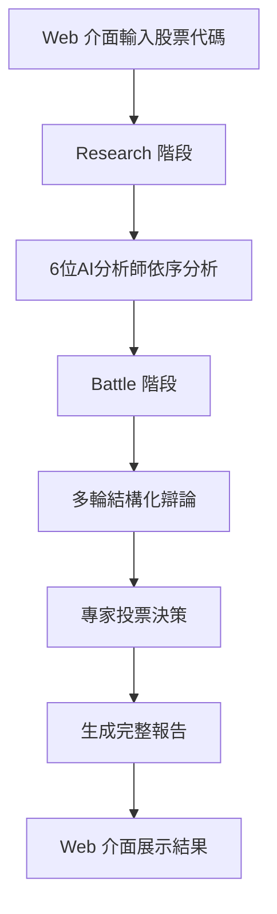

<h1 align="center">Willis Stock Genie - AI-Powered Stock Analysis Platform</h1>

<div align="center">

</div>

<p align="center">


<a href="https://fingenius.cn"></a>
</p>

## 📖 專案簡介

**Willis Stock Genie** 是一個基於多智能體架構的台股 AI 分析平台，採用 **Research-Battle 雙環架構**，透過 6 位專業 AI 分析師協作，為投資者提供全方位的股票分析報告。

### 🎯 核心特色

- **🤖 多智能體協作**：6 位專業 AI 分析師深度分析
- **⚔️ 雙環架構**：研究階段 + 辯論投票決策
- **🛠️ MCP 工具導向**：每個代理配置專屬工具集
- **🌐 Web 圖形介面**：直觀易用的瀏覽器操作介面
- **📊 台股本地化**：整合 FinMind、yfinance、twstock
- **📄 完整報告**：HTML 報告 + JSON 數據 + 辯論記錄
- **🔄 即時通信**：WebSocket 實時進度更新

---

## 🚀 快速開始

### 環境要求

- Python 3.12+
- DeepSeek API Key（或其他支持的 LLM API）

### 安裝步驟

1. **克隆專案**
```bash
git clone https://github.com/huayaoyuanjin/FinGenius.git
cd FinGenius
```

2. **安裝依賴**
```bash
python3 -m venv .venv
source .venv/bin/activate        # Windows: .venv\Scripts\activate
pip install --upgrade pip
pip install -r requirements.txt
```

3. **配置 API**

編輯 `config/config.toml`，填入你的 API 金鑰：
```toml
[llm]
api_type = "deepseek"
model = "deepseek-chat"
base_url = "https://api.deepseek.com/v1"
api_key = "sk-your-api-key-here"  # 替換為你的金鑰
max_tokens = 4096
temperature = 0.7
```

4. **啟動服務**

**方式一：使用 Docker（推薦，環境完全兼容）**
```bash
# 構建並啟動
docker-compose up -d

# 查看日誌
docker-compose logs -f
```

**方式二：直接運行（需要 Python 3.12）**
```bash
cd web
python3 server.py
```

5. **開始使用**

在瀏覽器中訪問：`http://localhost:8000`

**注意**：如果使用 Python 3.13 可能遇到兼容性問題，建議使用 Docker 方式啟動。

---

## 🌐 線上部署

### 快速部署到 Render（完全免費）

**只需 5 分鐘！** 查看詳細指南：
- 📖 **快速指南** (推薦): [DEPLOYMENT_QUICK.md](DEPLOYMENT_QUICK.md)
- 📚 **完整指南**: [DEPLOYMENT.md](DEPLOYMENT.md)

#### 部署步驟概覽
1. 推送代碼到 GitHub
2. 在 Render.com 連接倉庫
3. 設置 API 密鑰
4. 點擊部署！

**免費資源**:
- ✅ 512MB RAM
- ✅ 免費域名 (*.onrender.com)
- ✅ 支持 WebSocket
- ✅ 自動 HTTPS

---

## 💻 使用方式

### Web 介面操作

1. **輸入股票代碼**
   - 在輸入框中輸入台股代碼（如：2330 台積電）
   - 點擊「驗證」按鈕確認股票資訊

2. **開始分析**
   - 點擊「開始分析」按鈕
   - 系統自動執行三階段分析：
     - 🔍 **Research 階段**：6 位 AI 專家深度分析
     - ⚔️ **Battle 階段**：專家辯論與投票決策
     - 📄 **Report 生成**：生成 HTML 和 JSON 報告

3. **查看結果**
   - 切換不同標籤頁查看分析結果：
     - **總覽**：股票基本資訊與 AI 綜合評估
     - **技術分析**：K線圖表與技術指標
     - **三大法人**：外資、投信、自營商動向
     - **籌碼分析**：籌碼集中度與分佈
     - **輿情分析**：市場情緒與熱點話題
     - **風險評估**：風險等級與控制建議
     - **辯論結果**：AI 專家投票與最終決策

### 特色功能

- 🖱️ **點擊操作**：無需命令行，圖形介面直觀易用
- 📊 **即時進度**：WebSocket 實時顯示分析進度
- 📈 **互動圖表**：Chart.js 動態圖表展示
- 🔄 **完整流程**：Research + Battle + Report 一站式分析
- 💾 **多格式輸出**：HTML 美化報告 + JSON 結構化數據
- ⚡ **取消功能**：可隨時取消正在進行的分析

---

## 🏗️ 架構設計

### 專案結構

```
FinGenius/
├── config/
│   └── config.toml          # 系統配置
├── src/
│   ├── agent/               # 6 位 AI 分析師
│   ├── environment/         # Research & Battle 環境
│   ├── tool/                # 台股數據工具
│   ├── prompt/              # Agent 提示詞
│   └── utils/               # 工具函數
├── web/
│   ├── server.py            # FastAPI WebSocket 服務器
│   ├── index.html           # 前端介面
│   ├── app.js               # 前端邏輯
│   └── styles.css           # 樣式
├── report/                  # 生成的報告
│   ├── html/                # HTML 報告
│   ├── debate/              # 辯論 JSON
│   └── vote/                # 投票 JSON
└── docs/                    # 文檔與圖示
```

### 🤖 6 位專業 AI 分析師

| Agent | 角色 | 職責 |
|-------|------|------|
| **sentiment_agent** | 輿情分析師 | 蒐集市場情緒、熱門話題、資金流向 |
| **risk_control_agent** | 風險控制專家 | 政策風險、財務風險、法務風險評估 |
| **institutional_investor_agent** | 三大法人分析師 | 外資、投信、自營商買賣超追蹤 |
| **technical_analysis_agent** | 技術分析師 | K線、指標、融資融券趨勢分析 |
| **chip_analysis_agent** | 籌碼分析師 | 籌碼集中度、主力/散戶行為 |
| **big_deal_analysis_agent** | 大單分析師 | 監控大額交易與異動 |

### 🔄 完整分析流程



**三階段分析：**

1. **Research 階段** 🔍
   - 6 位 AI 分析師依序深度分析
   - 調用專屬工具獲取台股數據
   - 產生各領域專業分析報告
   - 實時進度更新

2. **Battle 階段** ⚔️
   - 基於研究結果進行多輪辯論
   - 每位專家發表看多/看空觀點
   - 最終投票決定市場預測
   - 記錄完整辯論過程

3. **Report 生成** 📄
   - HTML 美化報告（含圖表和辯論記錄）
   - JSON 結構化數據（辯論 + 投票）
   - 自動保存到 report/ 目錄
   - Web 介面即時顯示

---

## 🌟 使用範例

### 範例 1：分析台積電（2330）

1. 啟動服務器：
```bash
cd web
python3 server.py
```

2. 打開瀏覽器訪問：`http://localhost:8000`

3. 輸入股票代碼：`2330`

4. 點擊「驗證」確認股票資訊

5. 點擊「開始分析」等待結果

6. 在「辯論結果」標籤頁查看 AI 專家的最終決策

### 範例 2：常用台股代碼

| 代碼 | 公司名稱 | 產業 |
|------|---------|------|
| 2330 | 台積電 | 半導體 |
| 2317 | 鴻海 | 電子零組件 |
| 2454 | 聯發科 | 半導體 |
| 2881 | 富邦金 | 金融保險 |
| 2882 | 國泰金 | 金融保險 |
| 2412 | 中華電 | 通信網路 |

---

## 🔧 台股本地化

### 已整合的資料源

- **FinMind**：三大法人、融資融券、月營收
- **yfinance**：股價、歷史數據、K線圖
- **twstock**：台股基本資料、產業分類
- **pandas-ta**：技術指標計算（RSI、MACD、布林通道等）

### 支持的數據類型

- ✅ 股票基本資訊（代碼、名稱、產業）
- ✅ 三大法人買賣超（外資、投信、自營商）
- ✅ 融資融券數據
- ✅ K 線與技術指標
- ✅ 月營收數據
- ✅ 歷史股價走勢
- ⏳ 籌碼分析（開發中）
- ⏳ 大單異動（開發中）

---

## ❓ 常見問題

### Q1: 如何啟動 FinGenius？

```bash
cd web
python3 server.py
```
然後在瀏覽器訪問 `http://localhost:8000`

### Q2: 分析一支股票需要多久？

完整分析（Research + Battle + Report）通常需要 **2-5 分鐘**，具體取決於：
- API 響應速度
- 網絡狀況
- 辯論輪數設置

### Q3: 生成的報告保存在哪裡？

所有報告自動保存在專案根目錄的 `report/` 資料夾：
- `report/html/` - HTML 美化報告
- `report/debate/` - 辯論記錄 JSON
- `report/vote/` - 投票結果 JSON

### Q4: API 費用如何？

使用 DeepSeek API 的費用估算：
- 費用：約 ¥0.001/千 token
- 單次完整分析：10,000-30,000 tokens
- **預估成本：¥0.01-0.03/次**

### Q5: 支援哪些股票市場？

目前專注於 **台灣股票市場**（台股），支持：
- 上市股票（TWSE）
- 上櫃股票（TPEx）

### Q6: 如何自訂分析參數？

在 Web 介面中，系統使用預設參數：
- `max_steps`: 3（每個 Agent 最大步數）
- `debate_rounds`: 2（辯論輪數）

如需調整，可修改 `web/server.py` 中的 `handle_analysis_request` 方法。

### Q7: WebSocket 連接失敗怎麼辦？

如果看到「使用模擬模式」提示：
1. 確認 server.py 正在運行
2. 檢查端口 8000 是否被占用
3. 嘗試重新啟動服務器
4. 檢查防火牆設置

---

## 📝 開發計劃

### 已完成 ✅
- [x] 多智能體 Research 環境
- [x] Battle 辯論與投票機制
- [x] Web 圖形介面
- [x] WebSocket 實時通信
- [x] HTML 報告生成
- [x] JSON 數據導出
- [x] 台股數據整合

### 進行中 🚧
- [ ] 完成籌碼分析工具本地化
- [ ] 完成大單分析工具本地化
- [ ] 添加單元測試與整合測試
- [ ] 性能優化與快取機制

### 未來功能 🔮
- [ ] 支持多股票對比分析
- [ ] 添加用戶帳號系統
- [ ] 歷史分析記錄查詢
- [ ] PDF 報告導出
- [ ] 即時股價更新
- [ ] 移動端適配
- [ ] 自訂分析參數介面
- [ ] 報告分享功能

---

## 🛠️ 技術棧

### 後端
- **FastAPI**：高性能 Web 框架
- **WebSocket**：實時雙向通信
- **asyncio**：異步 I/O 處理
- **OpenManus**：多智能體框架

### 前端
- **HTML5 + Bootstrap 5**：響應式界面
- **Chart.js**：數據可視化
- **Vanilla JavaScript**：原生 JS，無需打包

### AI & 數據
- **DeepSeek API**：大語言模型
- **FinMind**：台股數據 API
- **yfinance**：金融數據獲取
- **pandas-ta**：技術分析指標

---

## 📜 授權協議

本專案採用 **GPL v3** 授權，詳見 [LICENSE](LICENSE)。

### ⚠️ 重要聲明

- 本專案僅供**研究與教學用途**
- 所有輸出均為 AI 推演結果，**不構成投資建議**
- **投資有風險，入市需謹慎**
- 使用本平台產生的任何投資損失，開發者不承擔責任
- 禁止項目代碼及框架**閉源商用**

---

## 🙏 致謝

- 基於 [OpenManus](https://github.com/mannaandpoem/OpenManus) 多智能體框架開發
- 特別感謝 [JayTing511](https://github.com/JayTing511) 的支持
- 項目顧問：[mannaandpoem](https://github.com/mannaandpoem)
- 感謝所有為開源社區貢獻的開發者

---

## 📮 聯繫方式

- **GitHub Issues**：https://github.com/huayaoyuanjin/FinGenius/issues
- **Website**：https://fingenius.cn
- **Email**：support@fingenius.cn

歡迎所有 AI 和金融領域的開發者與研究者加入 FinGenius 開源社區！⭐

如果這個項目對你有幫助，請給我們一個 Star！

---

<div align="center">
Made with ❤️ by FinGenius Team
</div>
